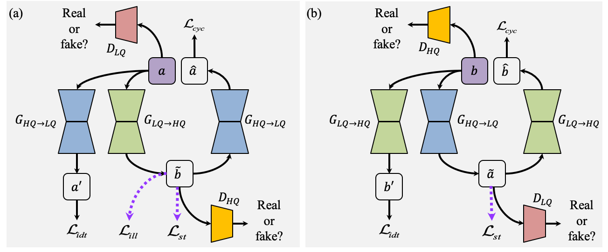
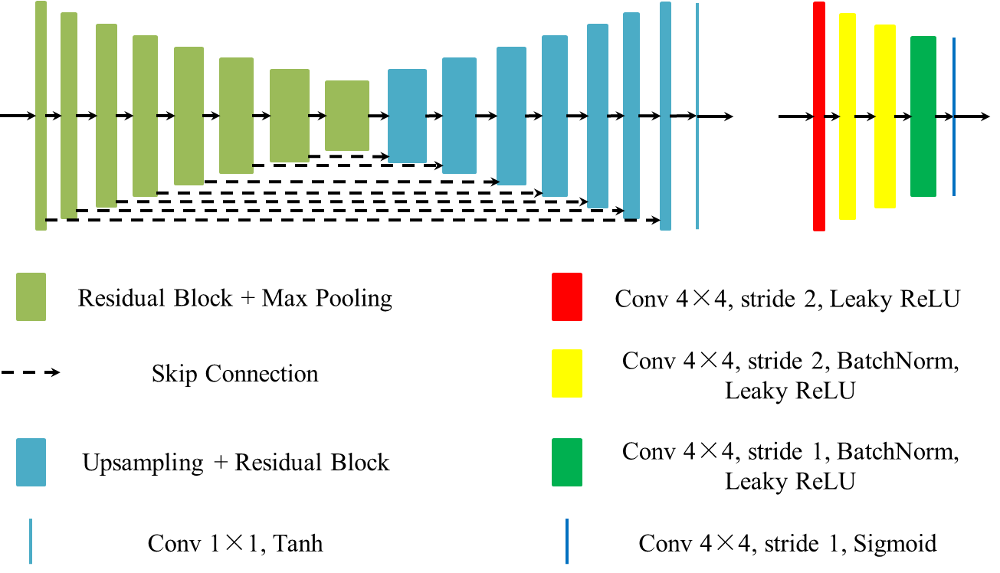

<span id="jump1"></span>
# StillGAN: Structure and Illumination Constrained GAN for Medical Image Enhancement



###  [Paper](https://ieeexplore.ieee.org/document/9503421) | [BibTex](#jump2)

Structure and Illumination Constrained GAN for Medical Image Enhancement<br>

[Yuhui Ma](#jump1),  [Jiang Liu](#jump1),  [Yonghuai Liu](#jump1),  [Huazhu Fu](#jump1),  [Yan Hu](#jump1),  [Jun Cheng](#jump1),  [Hong Qi](#jump1),  [Yufei Wu](#jump1),  [Jiong Zhang](#jump1),  [Yitian Zhao](#jump1)<br>

### [License](https://github.com/iMED-Lab/StillGAN/blob/master/LICENSE)

All rights reserved.

The code and data are released for academic research use only. For commercial use, please contact [yitian.zhao@nimte.ac.cn](#jump1).

## Condensed Abstract

The development of medical imaging techniques has greatly supported clinical decision making. However, poor imaging quality, such as non-uniform illumination or imbalanced intensity, brings challenges for automated screening, analysis and diagnosis of diseases. Previously, bi-directional GANs (e.g., CycleGAN), have been proposed to improve the quality of input images without the requirement of paired images. However, these methods focus on global appearance, without imposing constraints on structure or illumination, which are essential features for medical image interpretation. In this paper, we propose a novel and versatile bi-directional GAN, named Structure and illumination constrained GAN (StillGAN), for medical image quality enhancement. Our StillGAN treats low- and high-quality images as two distinct domains, and introduces local structure and illumination constraints for learning both overall characteristics and local details. Extensive experiments on three medical image datasets (e.g., corneal confocal microscopy, retinal color fundus and endoscopy images) demonstrate that our method performs better than both conventional methods and other deep learning-based methods. In addition, we have investigated the impact of the proposed method on different medical image analysis and clinical tasks such as nerve segmentation, tortuosity grading, fovea localization and disease classification. 

## Getting Started

Clone this repo
```
git clone https://github.com/iMED-Lab/StillGAN.git
```

Install prerequisites
```
cd StillGAN
pip install -r requirements.txt
```

Prepare your data

Please put the root directory of your dataset into the folder ./datasets. The root directory should contain four subfolder: trainA (low-quality images for training), trainB (high-quality images for training), testA (low-quality images for testing) and testB (high-quality images for testing). 

The information about the CORN-2 dataset could be seen in the following link: 

https://imed.nimte.ac.cn/CORN.html

## Run the code

### Start Visdom
```
    python -m visdom.server
```
### Training (Demo for CORN-2 dataset)
```
    python train.py --dataroot ./datasets/CORN-2 --name ccm_stillgan \
                    --model cycle_gan --pool_size 50 --no_dropout \
                    --input_nc 1 --output_nc 1 --display_env ccm_stillgan
```
### Testing (Demo for CORN-2 dataset)
```
    python test.py --dataroot ./datasets/CORN-2/testA/ --name ccm_stillgan \
                   --model test --dataset_mode single --phase test --eval \
                   --no_dropout --input_nc 1 --output_nc 1 --model_suffix _A
```


<span id="jump2"></span>
### Citation
If you use this code for your research, please cite our papers. 
```
@article{ma2021stillgan,
  title={Structure and Illumination Constrained GAN for Medical Image Enhancement},
  author={Ma, Yuhui and Liu, Jiang and Liu, Yonghuai and Fu, Huazhu and Hu, Yan and Cheng, Jun and Qi, Hong and Wu, Yufei and Zhang, Jiong and Zhao, Yitian},
  journal={IEEE Transactions on Medical Imaging},
  year={2021},
  volume={},
  number={},
  pages={1-1},
  doi={10.1109/TMI.2021.3101937},
  publisher={IEEE}
}
```
